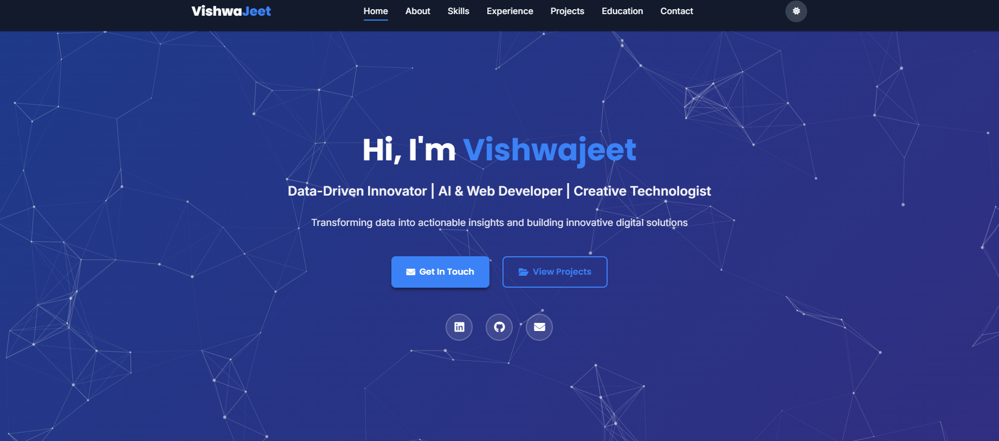
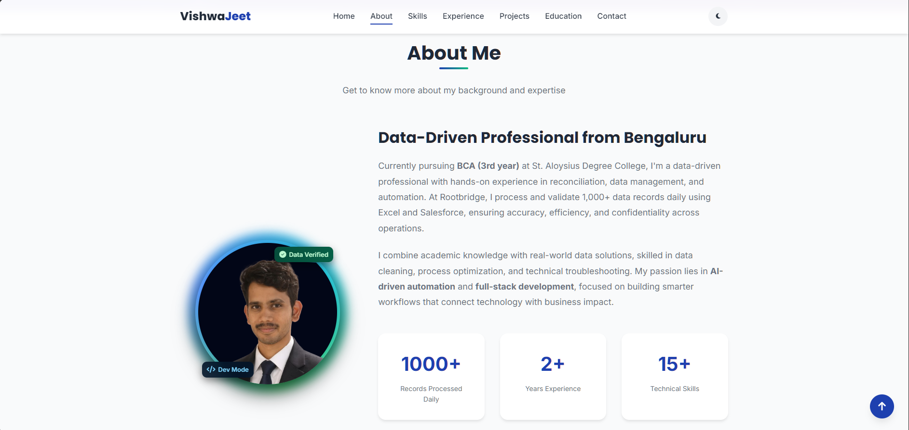
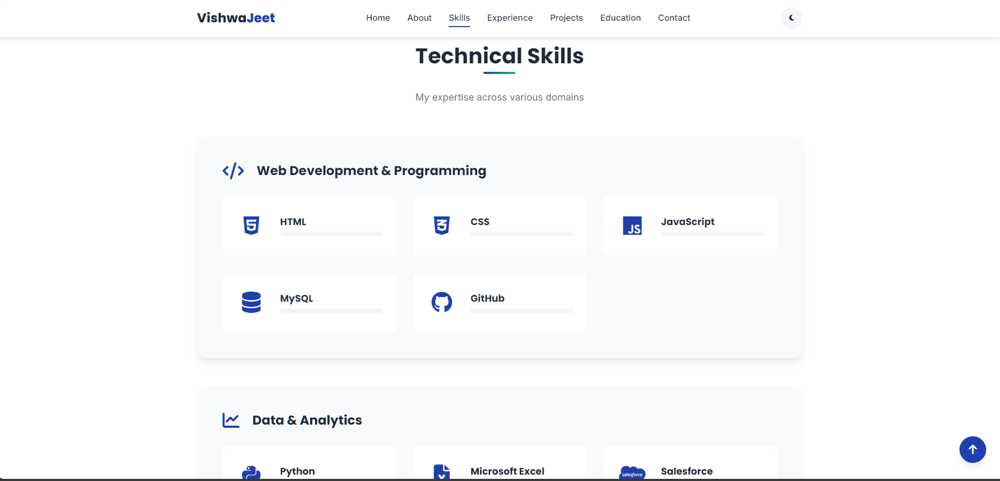

# Vishwajeet – Personal Portfolio Website 🌐

A modern, interactive, and fully responsive **personal portfolio website** showcasing my skills, projects, and professional journey in **Full-Stack Web Development, Data Analytics, and AI-Driven Automation**.

---

## 🎥 Live Portfolio Preview (Auto-Play)

<p align="center">
  <a href="./video.mp4">
    
  </a>
</p>

> ▶️ **GIF auto-plays** on GitHub  


---

## 🌟 Overview

This portfolio is designed with a **clean UI, smooth animations, and responsive layout** to professionally present my profile to recruiters and collaborators.

### 🔍 Focus Areas
- Full-Stack Web Development  
- Data Analytics & Management  
- AI-Powered Automation  
- Creative UI & Multimedia Design  

---

## 🏠 Home Section

<p align="center">
  
</p>

- Strong introduction and personal branding
- Clear call-to-action buttons
- Smooth scrolling navigation

---

## 👤 About Me

<p align="center">
  
</p>

- Passionate web developer and data-driven professional
- Interest in AI automation and real-world problem solving
- Clean visual layout with profile image

<p align="center">
  
</p>

---

## 🎓 Education & Certifications

<p align="center">
  
</p>

- Bachelor of Computer Applications (BCA)
- Technical and professional certifications
- Continuous learning mindset

---

## 🛠️ Skills

<p align="center">
  
</p>

### 💡 Technical Skill Areas
- **Web Development**: HTML5, CSS3, JavaScript  
- **Data & Tools**: Python, Excel, Salesforce  
- **AI & Automation**: ChatGPT API, Prompt Engineering  

---

## 💼 Work Experience

<p align="center">
  
</p>

- Hands-on experience in data handling and automation
- Real-world project exposure
- Professional workflow practices

---

## 🚀 Featured Projects

<p align="center">
  
</p>

### 🔹 Highlights
- **AI Instagram Caption Generator**
  - AI-powered caption creation
  - Integrated with SMM workflow
- **Data Analytics Dashboard**
  - Python-based data visualization
- **Creative Multimedia Projects**
  - UI & social media design solutions

---

## 📞 Contact

<p align="center">
  
</p>

- Easy contact access
- Professional social links
- Clean call-to-action design

---

## 🛠️ Technologies Used

| Category | Tools & Technologies |
|--------|---------------------|
| Frontend | HTML5, CSS3, JavaScript |
| Styling | Custom CSS, Google Fonts |
| Scripts | JavaScript (ES6) |
| AI & Data | Python, AI APIs |
| Tools | GitHub, VS Code |

---

## 📁 Project Structure

```text
Vishwajeetsrk/
├── index.html
├── style.css
├── main.js
├── README.md
├── QUICKSTART.md
├── CUSTOMIZATION.md
├── video.mp4
├── allgif.gif
├── pro2 bg remove.png
├── home.png
├── about.png
├── skill.png
├── Work Experience.png
├── Education & Certifications.png
├── Featured Projects.png
└── Contact .png
